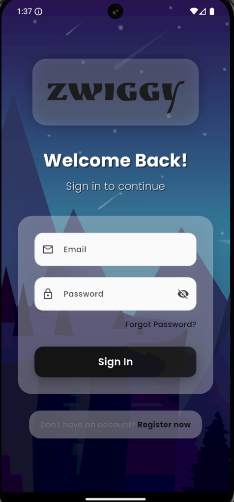
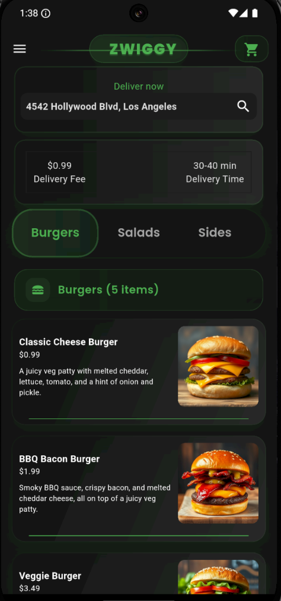
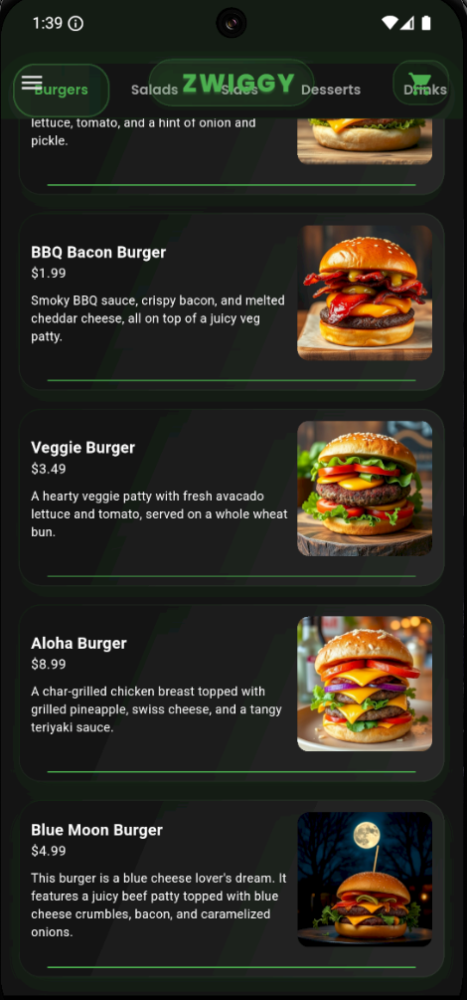

# 🍔 ZWIGGY - Food Delivery App

A modern, feature-rich food delivery application built with Flutter, offering a seamless ordering experience with beautiful UI/UX design and real-time functionality.


## 📱 Screenshots

<p align="center">
  
  
</p>
<p align="center">
  
</p>

## ✨ Features

### 🎨 Modern UI/UX
- **Glass Morphism Design**: Beautiful translucent containers with blur effects
- **Smooth Animations**: Staggered animations, elastic transitions, and micro-interactions
- **Dark/Light Theme Support**: Comprehensive theming system with adaptive colors
- **Responsive Design**: Optimized for various screen sizes and orientations

### 🔐 Authentication
- **Firebase Authentication**: Secure user registration and login
- **Email/Password Authentication**: Traditional auth method
- **Form Validation**: Real-time input validation with user feedback
- **Enhanced Security**: Password strength indicators and secure storage

### 🍕 Food Ordering System
- **Dynamic Menu**: Categorized food items (Burgers, Salads, Sides, Desserts, Drinks)
- **Interactive Food Cards**: Detailed food information with images and descriptions
- **Add-ons System**: Customizable food options and extras
- **Quantity Management**: Easy quantity selection with increment/decrement controls

### 🛒 Shopping Cart
- **Real-time Cart Updates**: Instant cart synchronization across the app
- **Price Calculations**: Automatic total calculation including add-ons
- **Item Management**: Add, remove, and modify cart items
- **Cart Persistence**: Maintains cart state throughout user session

### 📍 Location Services
- **Current Location Display**: Shows user's current delivery address
- **Location Management**: Update and manage delivery addresses
- **Delivery Information**: Clear delivery details and timing

### 🧾 Order Management
- **Receipt Generation**: Detailed order receipts with itemized billing
- **Order Tracking**: Visual order progress with animated states
- **Delivery Status**: Real-time delivery updates and notifications
- **Order History**: Complete order history and reordering capabilities

### 🎭 Enhanced User Experience
- **Lottie Animations**: Smooth vector animations for loading and interactions
- **Haptic Feedback**: Tactile feedback for user interactions (optional)
- **Pull-to-Refresh**: Intuitive content refresh mechanism
- **Empty State Handling**: Beautiful empty states with call-to-action buttons

## 🛠 Tech Stack

### Frontend
- **Flutter**: Cross-platform mobile development framework
- **Dart**: Programming language for Flutter development

### Backend & Services
- **Firebase Core**: Firebase SDK initialization and configuration
- **Firebase Authentication**: User authentication and management
- **Cloud Firestore**: NoSQL document database for real-time data

### State Management
- **Provider**: Lightweight state management solution
- **ChangeNotifier**: Reactive programming for UI updates

### UI/UX Libraries
- **Google Fonts**: Custom typography with Poppins font family
- **Lottie**: Vector animations and micro-interactions
- **Material Design 3**: Modern Material Design components

### Utilities
- **Collection**: Dart collection utilities for data manipulation
- **Intl**: Internationalization and localization support
- **Path Provider**: File system path management

## 🏗 Project Structure

```
lib/
├── components/
│   ├── my_button.dart              # Reusable button component
│   ├── my_cart_tile.dart           # Cart item display component
│   ├── my_current_location.dart    # Location display component
│   ├── my_description_box.dart     # App description component
│   ├── my_drawer.dart              # Navigation drawer
│   ├── my_drawer_tile.dart         # Drawer menu items
│   ├── my_food_tile.dart           # Food item display card
│   ├── my_quantity_selector.dart   # Quantity picker component
│   ├── my_sliver_app_bar.dart      # Custom app bar with ZWIGGY branding
│   ├── my_tab_bar.dart             # Enhanced tab navigation
│   └── my_textfield.dart           # Custom input field component
├── models/
│   ├── cart_item.dart              # Cart item data model
│   ├── food.dart                   # Food item and category models
│   └── restaurant.dart             # Restaurant and menu management
├── pages/
│   ├── cart_page.dart              # Shopping cart interface
│   ├── delivery_loading_animation_page.dart  # Order processing animation
│   ├── delivery_progress_page.dart # Order tracking interface
│   ├── food_page.dart              # Individual food item details
│   ├── home_page.dart              # Main app interface with enhanced UI
│   ├── login_page.dart             # User authentication - login
│   ├── my_receipt.dart             # Order receipt display
│   ├── payment_page.dart           # Payment processing interface
│   ├── register_page.dart          # User registration
│   └── settings_page.dart          # App settings and preferences
├── services/
│   ├── auth/                       # Authentication services
│   └── database/                   # Database interaction services
├── themes/
│   ├── dark_mode.dart              # Dark theme configuration
│   ├── light_mode.dart             # Light theme configuration
│   └── theme_provider.dart         # Theme management service
├── firebase_options.dart           # Firebase configuration
└── main.dart                       # App entry point
```

## 🚀 Getting Started

### Prerequisites
- Flutter SDK (3.5.4 or higher)
- Dart SDK
- Android Studio / VS Code
- Firebase account for backend services

### Installation

1. **Clone the repository**
   ```bash
   git clone https://github.com/DKSingh1604/food_delivery.git
   cd food_delivery
   ```

2. **Install dependencies**
   ```bash
   flutter pub get
   ```

3. **Firebase Setup**
   - Create a new Firebase project at [Firebase Console](https://console.firebase.google.com/)
   - Add Android/iOS apps to your Firebase project
   - Download and place `google-services.json` in `android/app/`
   - Enable Authentication and Firestore in Firebase Console

4. **Configure Firebase**
   ```bash
   flutter pub global activate flutterfire_cli
   flutterfire configure
   ```

5. **Run the app**
   ```bash
   flutter run
   ```

## 📱 App Features in Detail

### Home Page Enhancements
- **Gradient Backgrounds**: Radial and linear gradients for depth
- **Animated Tab Bar**: Custom pill-style tabs with gradient indicators
- **Staggered Animations**: Food items appear with elastic bounce effects
- **Category Headers**: Dynamic headers showing item counts with icons
- **Enhanced Food Cards**: Glass morphism design with multiple shadow layers

### Authentication System
- **Modern Login/Register UI**: Glass morphism forms with gradient backgrounds
- **Real-time Validation**: Instant feedback for user inputs
- **Enhanced Error Handling**: User-friendly error messages and states
- **Secure Authentication**: Firebase security with form validation

### Shopping Experience
- **Interactive Food Selection**: Smooth page transitions with combined animations
- **Add-ons Management**: Dynamic price calculation with customization options
- **Cart Synchronization**: Real-time cart updates across all app screens
- **Order Processing**: Animated order flow with progress indicators

## 🎨 Design System

### Color Scheme
- **Primary Colors**: Dynamic theme-based color system
- **Gradients**: Subtle gradients for depth and modern appearance
- **Opacity Layers**: Strategic use of transparency for glass morphism

### Typography
- **Font Family**: Poppins (Google Fonts)
- **Weight Variations**: Light (300) to ExtraBold (800)
- **Letter Spacing**: Enhanced readability with proper spacing

### Animations
- **Elastic Curves**: Bouncy, engaging transitions
- **Staggered Effects**: Sequential animations for list items
- **Micro-interactions**: Subtle feedback for user actions

## 🔧 Development Tools

### Build Configuration
- **Android Gradle Plugin**: 8.3.0
- **Gradle**: 8.4
- **Compile SDK**: 34
- **Target SDK**: 34

### Dependencies Management
- **Provider**: ^6.1.2 for state management
- **Google Fonts**: ^6.2.1 for typography
- **Lottie**: ^3.2.0 for animations
- **Firebase**: Latest versions for backend services

## 📊 Performance Optimizations

- **Lazy Loading**: Efficient list rendering with ListView.builder
- **Clamped Animations**: Safe animation values to prevent assertion errors
- **Optimized Images**: Proper image loading and caching
- **State Management**: Efficient state updates with Provider pattern

## 🤝 Contributing

1. Fork the repository
2. Create a feature branch (`git checkout -b feature/amazing-feature`)
3. Commit your changes (`git commit -m 'Add amazing feature'`)
4. Push to the branch (`git push origin feature/amazing-feature`)
5. Open a Pull Request

## 📄 License

This project is licensed under the MIT License - see the [LICENSE](LICENSE) file for details.

## 🙏 Acknowledgments

- **Flutter Team**: For the amazing cross-platform framework
- **Firebase**: For comprehensive backend services
- **Google Fonts**: For beautiful typography options
- **Material Design**: For design guidelines and components
- **Lottie**: For smooth vector animations

## 📞 Contact

**Developer**: DKSingh1604
- **GitHub**: [@DKSingh1604](https://github.com/DKSingh1604)
- **Project Link**: [Food Delivery App](https://github.com/DKSingh1604/food_delivery)

---

<div align="center">
  <strong>Built with ❤️ using Flutter</strong>
</div>
